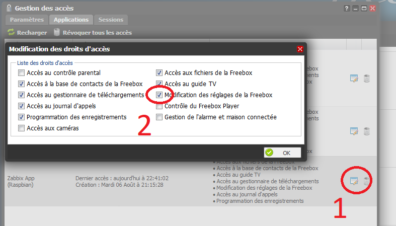
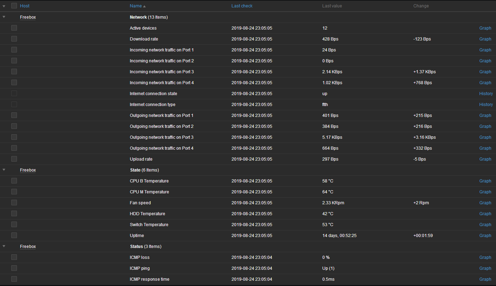

# Freebox-by-Zabbix-Monitoring

With this files, you will be able to monitor some metrics of your Freebox Revolution.

This script gets datas from Freebox, and sends it to Zabbix Server.

I've added the zabbix template to add easily datas into this wonderful monitoring tool.

Sorry for the quality of my source code, I'm learning Bash and Zabbix with this project! 

Thanks to [JrCs](https://github.com/JrCs/freeboxos-bash-api) for his code. That was a good start with his script. But I had to optimize it because the JSON parsing was not perfect... I replaced it in the code by [jq](https://stedolan.github.io/jq/) command-line.

# 1. Prerequites

This script has been tested with a **Raspberry PI 2**.
To work, you need to be sure that Zabbix is well installed (zabbix_sender command must be callable to send datas to Zabbix Server).

# 2. Installation

## 2.1. jq and curl installation
jq is like `sed` for JSON data - you can use it to slice and filter and map and transform structured data with the same ease that `sed`, `awk`, `grep` and friends let you play with text. The tool is available [here](https://stedolan.github.io/jq/).

To install jq and curl, execute the following command-line :

    apt install jq curl

## 2.2. Copy scripts

Create a directory to copy script files :

    installDir="/usr/src/zabbix/custom_scripts/freebox/"
    mkdir $installDir
    cd $installDir
    
Copy freeboxos_zabbix_library.sh and get_freebox_data.sh into this new directory.
    
    curl -l https://github.com/Aurelien-JOLLY/Freebox-by-Zabbix-Monitoring/blob/master/freeboxos_zabbix_library.sh > freeboxos_zabbix_library.sh
    curl -l https://github.com/Aurelien-JOLLY/Freebox-by-Zabbix-Monitoring/blob/master/get_freebox_data.sh > get_freebox_data.sh

## 2.3. Authorize app to call Freebox API

Our script must be authorized to call Freebox API.

    installDir="/usr/src/zabbix/custom_scripts/freebox/"
    source "$installDir/freeboxos_zabbix_library.sh"
    authorize_application 'Zabbix.app' 'Zabbix App' '1.0.0' 'Raspbian'

When executing this code, the command-line sends request to Freebox, which waits an aknowledgment on this front. You'll just have to authorize the App when pushing an arrow in the front of the Freebox.

At this moment, this script creates a new file (**freebox_token.conf**) which contains the AppID and the tocken for the connection.

To access to the full datas we need to monitor, connect to the [Freebox user interface](https://mafreebox.freebox.fr/).

Click on "***Paramètres de la Freebox***", "***Gestion des accès***", "***Applications***". Your App will appear in the list. Click on "***Editer***" button and check the "***Modification des réglages de la Freebox***" line, like below :

## 2.4. Crontab

Add a line to the ``/etc/crontab`` file :

    * * * * *       root  /bin/bash /usr/src/zabbix/custom_scripts/freebox/get_freebox_data.sh >/dev/null 2>&1

This line will execute each minute the script to retrieve data and send it to Zabbix.

If you want to have more security, create a user to execute the script (you will have to allow read/write/execute on the directory which contains the scripts).

Restart the cron service :

    service cron restart

# 3. Zabbix template import

The file [zbx_freebox_export_templates.xml](./zbx_freebox_export_templates.xml) is the Freebox template for Zabbix.

You will just have to import the template.

Once done, declare your Freebox as host, and link host to the newly imported template.

That's it!

Have fun!
